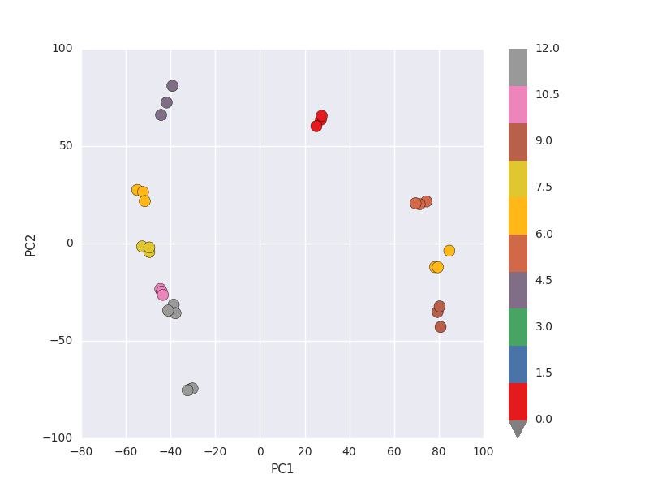

# Genetic Data PCA implementation

## Introduction

This analysis is carried out in order to uncover if it is possible to visualize
on statistical information obtained from Gene data. Feature engineering using principal
component analysis is applied on Genetic data to reduce the features to two dimensions to
visualize the data.

## Data description

In this analysis I used Genetic dataset, which contains 22411 features and 30 samples.
Files used in this analysis

Gene_data.csv.

Meta_data.csv.

## Principal component analysis

The main idea of principal component analysis (PCA) is to reduce the dimensionality of a data
set consisting of many variables correlated with each other, either heavily or lightly, while
retaining the variation present in the dataset, up to the maximum extent. The same is done by
transforming the variables to a new set of variables, which are known as the principal
components (or simply, the PCs) and are orthogonal, ordered such that the retention of variation
present in the original variables decreases as we move down in the order. So, in this way, the
1st principal component retains maximum variation that was present in the original components.
The principal components are the eigenvectors of a covariance matrix, and hence they are
orthogonal.

## Methods

### Exploratory analysis

This kind of analysis was conducted in order to identify the quality of data detect missing values,
outliers and choose observations for training and test sets. To make statistical modeling more
convenient, we slightly renamed the variables.
Exploratory analysis was performed by examining tables and plots of the obtained data.

Statistical Modeling

For statistical modeling I decided to choose two two supervised learning models

These two models are:

1.PCA

Linear dimensionality reduction using Singular Value Decomposition of the data to project it to a

lower dimensional space.It uses the LAPACK implementation of the full SVD or a randomized

truncated SVD by the method of Halko et al. 2009, depending on the shape of the input data

and the number of components to extract.

2.Random forest

An ensemble learning method for classification that operate by constructing a multitude of

decision trees at training time and outputting the class that is the mode of the classes output by

individual trees. This model was chosen due to its robustness and resistance to overfitting.

I used python module matplotlib for the visualizing the reduced dataset

## Results

x shape: (30, 22411)

y shape: (30,)

x dataset contains nan values in columns : [12076]

removed nan values in column: 12076

Explained variance: [3145.89499222 1995.86160249]

Explained variance ratio: [0.20147289 0.12782118]

x shape: (30,2)

Scatter plot of PC1 and PC

Model used for predicting values: RandomForestClassifier

Output of the model accuracy: 77.79%

## Conclusion

Dataset before PCA contains 22411 features and it is reduced to two dimension/features which
has more contribution to dataset variance.PC1 and PC2 are contributing more than 30% of
variance of dataset. Remaining 22409 dimension are contributing remaining 60% of variance of
dataset. After feature extraction using PCA.We visualized the dataset of containing PC1,PC
and target variable still genes of similar groups formed clusters and from this we can say that
whole dataset can be analysed with PC1 and PC
